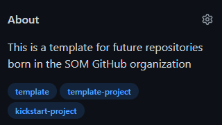

# template

This is a template for future repositories born in the SOM GitHub organization.
It offers a collection of files and repository configuration for kick-starting a new project under the SOM GitHub organization.

This repository does not have activated the use of issues, projects o wikis. Only Pull Requests are allowed.

> If you have **any** question, contact [Javier Cánovas](https://github.com/jlcanovas) via the SOM Slack app.

## Steps to customize this repo for your project

1. Create a new repository in the SOM GitHub organization using this template. You have to set the `Repository template` field to `SOM-Research/template`.

    

2. Edit the project description. You can do it in the `About` tab of the repository (click on the gear icon). Try to create a descriptive entry for the project, and include at least three tags. If the project has a website, indicate also the URL.

    

3. In the preovious menu, decide also whether your repository page should include `Releases`, `Packages` or `Environments` tabs. In case of doubt, remove them

4. Review the contributing guidelines in `CONTIBUTING.md`. Please, read carefully the provided template and adapt to your repository.

5. Review the code of conduct in `CODE_OF_CONDUCT.md`. Please, read carefully the provided template and adapt to your repository.

6. Review the governance model in `GOVERNANCE.md`. Please, read carefully the provided template and adapt to your repository.

7. Check that the proposed license matches with your project. The template includes the CC-BY-SA license, but you can change it to any other license. You can find a list of licenses in [Choose a License](https://choosealicense.com/).

8. Decide whether your project will use issues, projects, and wikis. You can de/activate them in the `Settings` tab of the repository.

9. Review the templates proposed for issues and pull requests. You can find them in the `.github` folder. Remove the folder if you do not plan to use them. 

    9.1. Issue templates are located in `.github/ISSUE_TEMPLATE`. You can find a template for proposals and questions, but you can modify or create new ones. You can find more information in [About issue and pull request templates](https://help.github.com/en/github/building-a-strong-community/about-issue-and-pull-request-templates). 

    9.2. Pull request template is located in `.github`. You can find more information in [About issue and pull request templates](https://help.github.com/en/github/building-a-strong-community/about-issue-and-pull-request-templates).

10. If your work is related to a paper, and you want to facilitate its citation, review the `CITATION.cff` file. The provided template will help to fill the gaps, but if you need more help, you can find more information in [Citation File Format](https://citation-file-format.github.io/). Otherwise, just remove the file.

11. Modify the `README.md` file. Once you have done the previous steps, write your the README file for your project. 