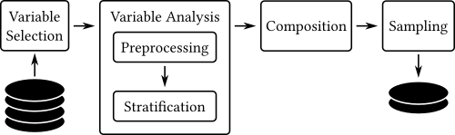

This repository provides the implementation (and replication package) of the approach presented in the paper [*On the Creation of Representative Samples of Software Repositories*](https://conf.researchr.org/details/esem-2024/esem-2024-emerging-results-vision-and-reflection-papers/7/On-the-Creation-of-Representative-Samples-of-Software-Repositories) accepted on the [*18th ACM/IEEE International Symposium on Empirical Software Engineering and Measurement (ESEM 2024)*](https://conf.researchr.org/home/esem-2024) conference. 

# What is this repository about?

This repository contains the implementation of a methodology for creating representative samples from datasets.
The tool allows selecting one or more variables (categorical o numerical) of interest related to software repositories to build a sample that is representative for such variables.  

The methodology employes stratified random sampling to create representative samples, focusing on key variables of interest. The following figure illustrates the approach. 

The process is split into four phases: 

* Variable Selection: This phase identifies the main analysis variables which will drive the creation of the sample.
* Variable Analysis: This phase performs the analysis of the selected variables. We consider two types of variables: numerical and categorical. The analysis process includes two steps: preprocessing and stratification. 

  * Preprocessing: This step focuses on studying the descriptive characteristics (e.g., range, distribution, etc.) of the variable. 

  * Stratification: The stratification process divides the data into homogeneous groups based on the variable of interest.

* Composition: This phase involves composing the strata of the selected variables to form a new strata distribution.

* Sampling: This phase creates the sample based on the new strata distribution.

You can find more details about the methodology in the paper.

In this repository you will find both the source code of the tool implementation and the data and Jupyter notebooks to replicate the running example of the paper, which will also help you to understand how to use the tool.

## Tool Implementation

The implementation of the methodology is offered as a Python library.

It is indexed in [PyPi](https://pypi.org/project/softsampling/), published as `softsampling`.
The code of the library is in the `softsampling/` folder.

The modules have been separated according to the variable type used to created the sample (i.e., numerical, categorical, or mixed), and one additional module for the preprocessing steps.

## Replication Package

The replication of the study can be performed by executing the Jupyter Notebooks in the folder `running-example`.

For each case of the running example (i.e., one numerical, one categorical, and two variables of different type) we provide a Jupyter notebook to reproduce the results, along with the HTML file of the execution.

The data is in the CSV file `type_likes.csv`, containing the targeted variables of the running example: `likes` and `type`.

The dependencies can be installed using the `requirements.txt` file (i.e., the implemented python package of the paper).

We recommend creating a virtual environment (e.g., venv, conda). The Python version must be >=3.9.

# Contributing

This project is part of a research line of the [SOM Research Lab](https://som-research.uoc.edu/) and [BESSER project](https://github.com/besser-pearl), but we are open to contributions from the community. Any comment is more than welcome!

If you are interested in contributing to this project, please read the [CONTRIBUTING.md](CONTRIBUTING.md) file.

# Code of Conduct

At SOM Research Lab and BESSER we are dedicated to creating and maintaining welcoming, inclusive, safe, and harassment-free development spaces. Anyone participating will be subject to and agrees to sign on to our [Code of Conduct](CODE_OF_CONDUCT.md).

# Governance

The development and community management of this project follows the governance rules described in the [GOVERNANCE.md](GOVERNANCE.md) document.

# License

This work is licensed under a <a rel="license" href="http://creativecommons.org/licenses/by-sa/4.0/">Creative Commons Attribution-ShareAlike 4.0 International License</a>

The [CC BY-SA](https://creativecommons.org/licenses/by-sa/4.0/) license allows users to distribute, remix, adapt, and build upon the material in any medium or format, so long as attribution is given to the creator. The license allows for commercial use. If you remix, adapt, or build upon the material, you must license the modified material under identical terms.

